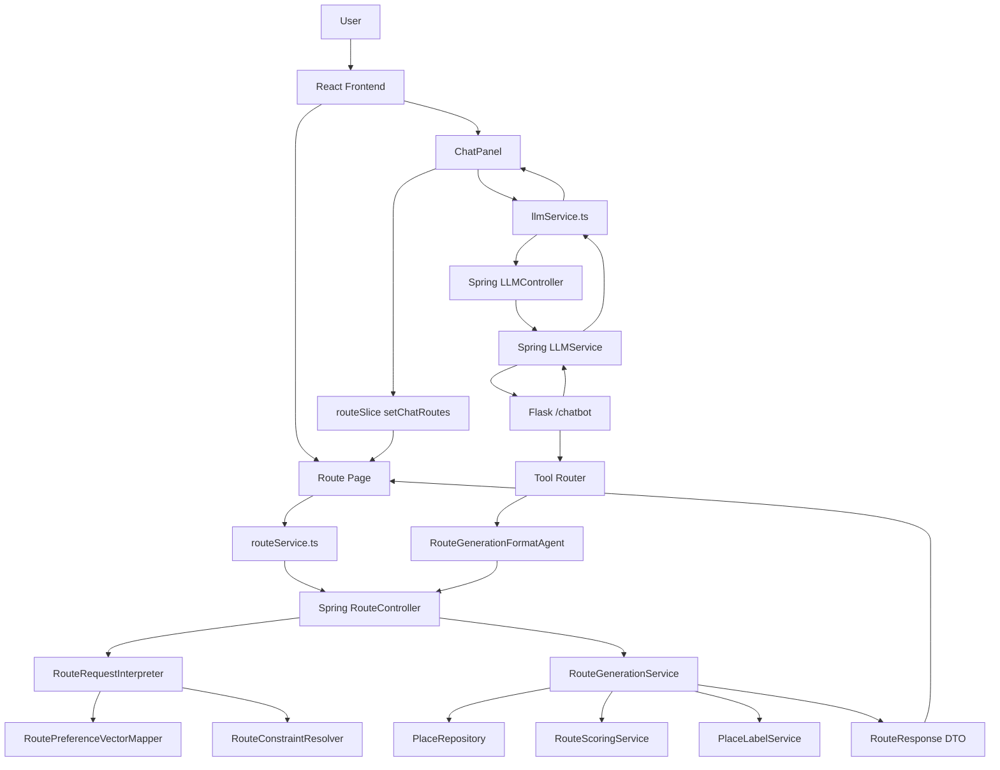
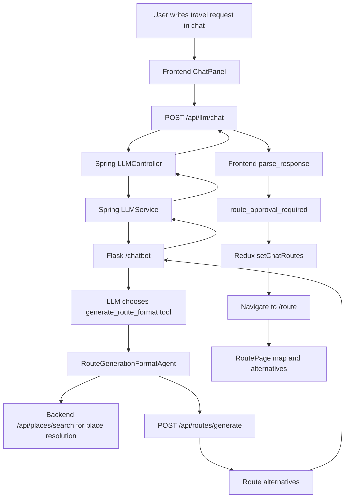

# RoadRunner Route Generation Technical Report

## Scope

This report explains three connected subsystems in the RoadRunner travel planning application:

1. Travel Persona System: preferences as vectors
2. Route Generation: from chat to map
3. Itinerary Modification: full control after generation

The deepest focus is Route Generation. The report is written as a technical input for a slide-generation tool, so it uses explicit headings, compact tables, diagrams, payloads, algorithms, and implementation notes.

---

## 1. Executive Summary

RoadRunner generates personalized Ankara travel routes by converting user preference answers into numeric route weights, combining those weights with explicit route constraints, selecting candidate places from the database, scoring and diversifying POIs, assembling route alternatives, and then allowing the user to edit and approve the result.

There are two main route-generation entry paths.

1. Direct Route Page flow
   - User selects or builds a travel profile.
   - User configures route constraints in the UI.
   - Frontend calls `POST /api/routes/generate`.
   - Spring Boot generates route alternatives directly.

2. Chat-to-map flow
   - User writes a natural-language trip request.
   - Frontend sends the message to Spring Boot `/api/llm/chat`.
   - Spring Boot proxies the message to the Flask LLM server.
   - Flask tool router calls `generate_route_format`.
   - The route-generation agent converts natural language into a structured route payload.
   - The agent posts that payload to Spring Boot `/api/routes/generate`.
   - Generated route alternatives return to the frontend as structured `routeData`.
   - Frontend stores alternatives in Redux and navigates to the Route page for approval and editing.

After generation, routes are not immutable. The user can reroll stops, remove stops, insert searched places, drag and drop stops, approve a route, save a route snapshot, use it for navigation, and ask the LLM to explain the route.

The backend route model is stateless during generation and editing. Generated routes are in-memory computation results. Persistence happens only when a route is approved or saved.

---

## 2. Implementation Map

### Backend Route Generation

| Responsibility | Main implementation |
|---|---|
| HTTP route generation and mutation endpoints | `backend/src/main/java/com/roadrunner/route/controller/RouteController.java` |
| Route generation algorithm | `backend/src/main/java/com/roadrunner/route/service/RouteGenerationService.java` |
| Preference-to-vector mapping | `backend/src/main/java/com/roadrunner/route/service/RoutePreferenceVectorMapper.java` |
| Request interpretation | `backend/src/main/java/com/roadrunner/route/service/RouteRequestInterpreter.java` |
| Constraint resolution | `backend/src/main/java/com/roadrunner/route/service/RouteConstraintResolver.java` |
| Constraint domain model | `backend/src/main/java/com/roadrunner/route/service/RouteConstraintSpec.java` |
| Candidate scoring | `backend/src/main/java/com/roadrunner/route/service/RouteScoringService.java` |
| Place labeling | `backend/src/main/java/com/roadrunner/route/service/DefaultPlaceRouteLabelService.java` |
| Geo math | `backend/src/main/java/com/roadrunner/route/service/GeoUtils.java` |
| Route DTOs | `backend/src/main/java/com/roadrunner/route/dto` |

### Backend Persona And Persistence

| Responsibility | Main implementation |
|---|---|
| Travel persona entity | `backend/src/main/java/com/roadrunner/user/entity/TravelPersona.java` |
| Travel persona CRUD | `backend/src/main/java/com/roadrunner/user/controller/UserController.java` |
| Persona business logic | `backend/src/main/java/com/roadrunner/user/service/UserService.java` |
| Saved route entity | `backend/src/main/java/com/roadrunner/user/entity/SavedRoute.java` |
| Saved route API | `backend/src/main/java/com/roadrunner/user/controller/SavedRouteController.java` |
| Saved route service | `backend/src/main/java/com/roadrunner/user/service/SavedRouteService.java` |

### Frontend

| Responsibility | Main implementation |
|---|---|
| Route API client | `frontend/src/services/routeService.ts` |
| Route Redux state | `frontend/src/store/routeSlice.ts` |
| Route page UI and workflows | `frontend/src/pages/RoutePage.tsx` |
| Editable route card | `frontend/src/components/route/EditableRouteCard.tsx` |
| Place search selector | `frontend/src/components/route/PlaceSearchAutocomplete.tsx` |
| Travel profile builder | `frontend/src/components/travel/TravelProfileBuilder.tsx` |
| Persona vector utility | `frontend/src/utils/travelProfile.ts` |
| LLM frontend adapter | `frontend/src/services/llmService.ts` |
| Chat panel route approval handoff | `frontend/src/components/chat/ChatPanel.tsx` |

### Flask LLM Layer

| Responsibility | Main implementation |
|---|---|
| Flask tool server | `utku/server/server.py` |
| Route-generation tool agent | `utku/chatbot/ai_agents.py`, class `RouteGenerationFormatAgent` |
| Route explanation agent | `utku/chatbot/ai_agents.py`, class `GeneratedRouteExplanationAgent` |
| Simple itinerary modification tool | `utku/chatbot/ai_agents.py`, class `ItineraryModificationAgent` |

---

## 3. High-Level Architecture



Key architecture notes:

- The route-generation algorithm lives in Spring Boot.
- The LLM does not generate final route geometry itself.
- The LLM converts natural language into structured route-generation input.
- The same Route page owns review, edit, approval, saving, and navigation handoff for both direct and chat-generated routes.

---

## 4. Travel Persona System: Preferences As Vectors

### 4.1 Purpose

The persona system stores a user's travel style in two equivalent forms:

1. Human-readable preference answers
2. Machine-usable route weights

The route generator ultimately consumes weights. The answers are useful for UI editing, summaries, persistence, and LLM-driven persona lookup.

### 4.2 Persona Data Model

`TravelPersona` is persisted in `travel_personas`.

| Field | Type | Meaning |
|---|---:|---|
| `id` | string UUID | persona identifier |
| `user` | relation | owner |
| `name` | string | display name |
| `isDefault` | boolean | default profile selector |
| `tempo` | double | relaxed vs packed route |
| `socialPreference` | double | quiet vs lively/social places |
| `naturePreference` | double | urban vs nature-heavy |
| `historyPreference` | double | low vs high historic/cultural interest |
| `foodImportance` | double | food as minor vs major route component |
| `alcoholPreference` | double | avoids vs accepts alcohol-related stops |
| `transportStyle` | double | walking/public transport/mixed/car |
| `budgetLevel` | double | budget-conscious vs flexible |
| `tripLength` | double | short vs long trip |
| `crowdPreference` | double | calm vs crowded/buzzy |
| `userVector` | JSON map | route-generation weights |

All numeric fields are intended to be normalized in `[0.0, 1.0]`.

### 4.3 Persona CRUD

Persona endpoints:

| Method | Path | Meaning |
|---|---|---|
| `GET` | `/api/users/me/personas` | list current user's personas |
| `POST` | `/api/users/me/personas/new` | create persona |
| `PUT` | `/api/users/me/personas/{personaId}` | update persona |
| `DELETE` | `/api/users/me/personas/{personaId}` | delete persona |
| `GET` | `/api/users/{userId}/personas` | internal Flask agent lookup |
| `PUT` | `/api/users/{userId}/personas/{personaId}` | internal Flask agent update |

Default persona handling:

- If a persona is created or updated with `isDefault=true`, other non-legacy personas for that user are cleared as default.
- Legacy personas are purged if they have no name or no vector.
- `safeUserVector` removes null keys and null values before persistence.

### 4.4 Vector Keys

| Vector key | Meaning |
|---|---|
| `weight_parkVeSeyirNoktalari` | parks, viewpoints, scenic outdoor places |
| `weight_geceHayati` | bars and nightlife |
| `weight_restoranToleransi` | restaurants and meal stops |
| `weight_landmark` | landmarks, attractions, entertainment |
| `weight_dogalAlanlar` | nature preserves and natural areas |
| `weight_tarihiAlanlar` | museums, historic places, cultural places |
| `weight_kafeTatli` | cafes, desserts, bakeries |
| `weight_toplamPoiYogunlugu` | route density and number of POIs |
| `weight_sparsity` | spread-out vs compact route preference |
| `weight_hotelCenterBias` | preference for central hotel anchor |
| `weight_butceSeviyesi` | budget level |

### 4.5 Preference-to-Vector Formulas

The frontend and backend implement the same mapping. Missing preference values receive defaults.

```text
tempo      = clamp01(preferences.tempo, default 0.5)
social     = clamp01(preferences.socialPreference, default 0.5)
nature     = clamp01(preferences.naturePreference, default 0.5)
history    = clamp01(preferences.historyPreference, default 0.5)
food       = clamp01(preferences.foodImportance, default 0.5)
alcohol    = clamp01(preferences.alcoholPreference, default 0.0 or 0.5 depending caller path)
transport  = clamp01(preferences.transportStyle, default 0.33)
budget     = clamp01(preferences.budgetLevel, default 0.5)
tripLength = clamp01(preferences.tripLength, default 0.5)
crowd      = clamp01(preferences.crowdPreference, default 0.5)
```

```text
parkVeSeyirNoktalari =
    clamp01(0.10 + nature * 0.52 + (1 - crowd) * 0.12 + tripLength * 0.08)

geceHayati =
    clamp01(0.04 + social * 0.38 + alcohol * 0.42 + crowd * 0.10 + tempo * 0.06)

restoranToleransi =
    clamp01(0.12 + food * 0.66 + tripLength * 0.08 + social * 0.06)

landmark =
    clamp01(0.18 + history * 0.24 + crowd * 0.10 + tempo * 0.05 + (1 - nature) * 0.04)

dogalAlanlar =
    clamp01(0.08 + nature * 0.70 + (1 - crowd) * 0.08)

tarihiAlanlar =
    clamp01(0.10 + history * 0.74 + (1 - tempo) * 0.06)

kafeTatli =
    clamp01(0.08 + food * 0.38 + social * 0.14 + (1 - tempo) * 0.14)

toplamPoiYogunlugu =
    clamp01(0.18 + tempo * 0.42 + tripLength * 0.32 + social * 0.06)

sparsity =
    clamp01(0.12 + transport * 0.42 + tripLength * 0.16 + nature * 0.08 + (1 - tempo) * 0.10)

hotelCenterBias =
    clamp01(0.88 - transport * 0.72 + (1 - crowd) * 0.05 + (1 - tempo) * 0.03)

butceSeviyesi =
    clamp01(budget)
```

Interpretation:

- High `tempo` increases route density.
- High `tripLength` increases density and spread.
- High `transportStyle` increases sparsity and lowers central hotel bias.
- High `naturePreference` raises parks and natural areas.
- High `historyPreference` strongly raises historic places.
- High `foodImportance` raises restaurants and cafes.
- High `alcoholPreference` raises nightlife.
- Low `crowdPreference` helps parks and natural areas.

### 4.6 Persona Selection In Direct Route Flow

The Route page supports:

| Mode | Meaning |
|---|---|
| `builder` | build a route-specific temporary profile |
| `saved-picker` | choose one saved profile |
| `saved` | use selected saved profile |
| `default` | use default saved profile |
| `none` | use neutral defaults |

When route generation is triggered, the page passes route count, center, constraints, profile `userVector`, and profile answer fields. Backend maps preferences, then overlays the explicit vector. This gives stable compatibility if frontend and backend formulas ever drift, because explicit `userVector` wins.

### 4.7 Persona Selection In Chat Flow

The Flask route-generation agent receives `user_id` from Spring Boot.

Selection order:

1. Use matching `persona_id` if provided.
2. Else use default persona.
3. Else use first persona.
4. Else use neutral defaults.

The Flask agent sends preference fields to Spring Boot. Spring can map those preferences into the actual route vector.

---

## 5. Route Generation Request Model

### 5.1 Main Request DTO

```java
class GenerateRoutesRequest {
    Map<String, String> userVector;
    RoutePreferencesRequest preferences;
    int k = 3;
    RouteConstraintsRequest constraints;
    Double centerLat;
    Double centerLng;
}
```

Validation and rules:

- `k` minimum is `1`.
- `k` maximum is `10`.
- At least one of `preferences` or `userVector` must be present.
- If both are present, backend maps `preferences` first and then overlays `userVector`.
- `centerLat` and `centerLng` are copied into the final vector.

### 5.2 Preferences DTO

```java
class RoutePreferencesRequest {
    Double tempo;
    Double socialPreference;
    Double naturePreference;
    Double historyPreference;
    Double foodImportance;
    Double alcoholPreference;
    Double transportStyle;
    Double budgetLevel;
    Double tripLength;
    Double crowdPreference;
}
```

The backend clamps every numeric preference to `[0,1]` and fills missing values with defaults.

### 5.3 User Vector Shape

`userVector` is a flexible string map.

```json
{
  "weight_tarihiAlanlar": "0.950",
  "weight_restoranToleransi": "0.200",
  "weight_toplamPoiYogunlugu": "0.700",
  "weight_sparsity": "0.500",
  "centerLat": "39.9208",
  "centerLng": "32.8541",
  "mode": "walking"
}
```

Special keys:

| Key | Meaning |
|---|---|
| `mode` or `travelMode` | optional travel mode |
| `centerLat` | optional center latitude |
| `centerLng` | optional center longitude |
| `weight_*` | route scoring weights |

Travel mode fallback:

- if mode is absent and `hotelCenterBias >= 0.66`, backend uses `walking`;
- otherwise backend uses `driving`.

### 5.4 Constraints DTO

```java
class RouteConstraintsRequest {
    Boolean stayAtHotel;
    Boolean needsBreakfast;
    Boolean needsLunch;
    Boolean needsDinner;

    Boolean startWithPoi;
    Boolean endWithPoi;
    Boolean startWithHotel;
    Boolean endWithHotel;

    RouteBoundarySelectionRequest startPoint;
    RouteBoundarySelectionRequest endPoint;

    RouteAnchorRequest startAnchor;
    RouteAnchorRequest endAnchor;

    List<RoutePoiSlotRequest> poiSlots;
}
```

There are two boundary models:

1. Legacy boundary model
   - `stayAtHotel`
   - `startWithPoi`
   - `endWithPoi`
   - `startWithHotel`
   - `endWithHotel`
   - `startAnchor`
   - `endAnchor`

2. Explicit boundary model
   - `startPoint`
   - `endPoint`

The direct Route page uses the explicit boundary model. The Flask chat agent currently sends legacy-style anchors.

### 5.5 Boundary Selection DTO

```java
class RouteBoundarySelectionRequest {
    String type;       // NONE, HOTEL, PLACE, TYPE
    String placeId;    // required for PLACE
    String poiType;    // required for TYPE
    RouteCandidateFiltersRequest filters;
}
```

| Boundary type | Meaning |
|---|---|
| `NONE` | no fixed start/end point |
| `HOTEL` | backend selects a hotel |
| `PLACE` | exact place id is used |
| `TYPE` | backend selects best place matching a type |

### 5.6 POI Slot DTO

```java
class RoutePoiSlotRequest {
    String kind;       // PLACE or TYPE
    String placeId;    // for PLACE
    String poiType;    // for TYPE
    RouteCandidateFiltersRequest filters;
}
```

Slot semantics:

| Slot value | Meaning |
|---|---|
| `null` | generated placeholder |
| `{}` | generated placeholder |
| `{ "kind": "PLACE", "placeId": "..." }` | exact interior POI |
| `{ "kind": "TYPE", "poiType": "PARK" }` | backend picks matching type |

Important:

- `poiSlots` define interior visit slots only.
- Hotels cannot be interior POIs.
- Meals are handled separately from slot count.
- Ordered slot order is preserved in constrained ordered mode.

### 5.7 Candidate Filters

```java
class RouteCandidateFiltersRequest {
    Double minRating;
    Integer minRatingCount;
}
```

Filters can apply to:

- boundary TYPE selection;
- hotel TYPE selection;
- POI TYPE slots.

---

## 6. Route Response Model

### 6.1 Route Response

```java
class RouteResponse {
    String routeId;
    List<RoutePointResponse> points;
    List<RouteSegmentResponse> segments;
    int totalDurationSec;
    double totalDistanceM;
    boolean feasible;
    String travelMode;
}
```

### 6.2 Route Point Response

```java
class RoutePointResponse {
    int index;
    String poiId;
    String poiName;
    double latitude;
    double longitude;
    String formattedAddress;
    List<String> types;
    double ratingScore;
    int ratingCount;
    String priceLevel;
    int plannedVisitMin;
    boolean fixedAnchor;
    boolean protectedPoint;
    String protectionReason;
}
```

Point flags:

| Field | Meaning |
|---|---|
| `fixedAnchor` | start/end anchor |
| `protectedPoint` | point introduced by a hard constraint, anchor, or meal |
| `protectionReason` | reason such as `start-anchor:hotel`, `slot:place`, `meal:lunch` |

### 6.3 Route Segment Response

```java
class RouteSegmentResponse {
    int fromIndex;
    int toIndex;
    int durationSec;
    double distanceM;
}
```

There is no road geometry yet. Segments are straight-line Haversine estimates.

---

## 7. Backend Route Generation Pipeline

### 7.1 Entry Point

Backend endpoint:

```http
POST /api/routes/generate
```

Controller flow:

```java
ResolvedRouteGenerationRequest resolved = requestInterpreter.interpret(req);
List<Route> routes = routeService.generateRoutes(resolved, req.getK());
return routes.stream().map(RouteResponse::fromRoute).toList();
```

### 7.2 Request Interpreter

The interpreter performs two tasks:

1. Build final user vector
   - map `preferences` to weights;
   - merge `userVector` over mapped weights;
   - copy `centerLat` and `centerLng` into vector.

2. Decide route mode
   - if constraints are empty, use legacy fallback;
   - otherwise resolve constraints and use constrained generation.

Pseudocode:

```text
function interpret(req):
    userVector = vectorMapper.buildGenerationUserVector(req)
    constraints = req.constraints

    if constraintResolver.shouldUseLegacyFallback(constraints):
        stayAtHotel = constraints absent OR constraints.stayAtHotel absent OR true
        return ResolvedRouteGenerationRequest(userVector, true, stayAtHotel, null)

    spec = constraintResolver.resolve(req, userVector)
    return ResolvedRouteGenerationRequest(userVector, false, false, spec)
```

### 7.3 Parsed Weight Request

The route generator converts the string vector into a typed record:

```java
record ParsedWeightRequest(
    String requestId,
    String travelMode,
    Double centerLat,
    Double centerLng,
    double parkVeSeyirNoktalari,
    double geceHayati,
    double restoranToleransi,
    double landmark,
    double dogalAlanlar,
    double tarihiAlanlar,
    double kafeTatli,
    double toplamPoiYogunlugu,
    double sparsity,
    double hotelCenterBias,
    double butceSeviyesi
)
```

Important behavior:

- A fresh UUID request id is generated every time.
- Repeated identical payloads can still produce different alternatives.
- Missing center uses Ankara Kizilay coordinates: `39.9208`, `32.8541`.
- All weights are clamped to `[0,1]`.

---

## 8. Candidate Data And Place Labeling

### 8.1 Place Entity

The route generator selects from `Place` rows.

| Field | Meaning |
|---|---|
| `id` | Google place id, primary key |
| `name` | place name |
| `formattedAddress` | address |
| `latitude` | WGS-84 latitude |
| `longitude` | WGS-84 longitude |
| `types` | comma-separated Google place types |
| `ratingScore` | average rating |
| `ratingCount` | number of reviews |
| `priceLevel` | price token |
| `businessStatus` | operational status |

### 8.2 Candidate Pool Filtering

Candidate pool creation:

```text
pool = all places
filter out businessStatus != OPERATIONAL
filter out ratingCount < 100
```

This removes closed and low-confidence places before scoring.

### 8.3 Semantic Labels

Each place is mapped to exactly one route label.

| Label | Meaning |
|---|---|
| `PARK_VE_SEYIR_NOKTALARI` | parks, viewpoints, gardens |
| `GECE_HAYATI` | bars and nightclubs |
| `RESTORAN_TOLERANSI` | restaurants and food places |
| `LANDMARK` | tourist attractions, stadiums, halls |
| `DOGAL_ALANLAR` | nature preserves and natural areas |
| `TARIHI_ALANLAR` | museums, historical landmarks, galleries, libraries |
| `KAFE_TATLI` | cafes, coffee shops, bakeries, tea houses |
| `HOTEL` | hotel, lodging, guest house |
| `UNKNOWN` | no usable routing label |

### 8.4 Label Priority

If a place has multiple types, priority is:

1. Hotel
2. Nightlife
3. Historic/cultural
4. Restaurant
5. Cafe/dessert
6. Parks/viewpoints
7. Landmark
8. Natural areas
9. Unknown

Implications:

- A hotel with restaurant metadata remains a hotel.
- A place that is both museum and cafe becomes historic/cultural.
- Single-label classification simplifies quotas but loses secondary interests.

---

## 9. Core Route Generation Algorithm

The backend route generator is implemented in `RouteGenerationService`. It has two operating modes:

1. Legacy mode: used when no advanced constraints are supplied.
2. Constrained mode: used when explicit boundaries, meal requirements, or POI slots are supplied.

Both modes share the same underlying ingredients:

- A parsed preference vector.
- A labeled candidate pool.
- Category quotas.
- Candidate scoring.
- Deterministic random variation.
- Local distance and duration estimation.
- Final route validation.

### 9.1 Parsed Weight Request

The input vector is normalized into an internal `ParsedWeightRequest`.

Core fields:

| Field | Meaning |
|---|---|
| `requestId` | UUID used as part of deterministic randomization |
| `travelMode` | `walking`, `cycling`, or `driving` |
| `centerLat` | generation center latitude |
| `centerLng` | generation center longitude |
| `park` | weight for parks and viewpoints |
| `nightlife` | weight for nightlife |
| `restaurant` | weight for food |
| `landmark` | weight for landmarks |
| `nature` | weight for natural areas |
| `historical` | weight for historical/cultural places |
| `cafe` | weight for cafes and desserts |
| `density` | controls approximate route length |
| `sparsity` | controls willingness to spread points apart |
| `hotelCenterBias` | controls hotel centrality preference |
| `budget` | normalized budget preference |

The generator does not work directly with text preferences. By the time generation starts, all meaningful soft preferences have become numbers.

### 9.2 Travel Mode Defaulting

If the request does not explicitly provide a travel mode, the generator chooses one from the vector:

```text
if hotelCenterBias >= 0.66:
    travelMode = walking
else:
    travelMode = driving
```

This is a heuristic. Strong hotel-center bias implies compact city-center itineraries, which are more compatible with walking.

### 9.3 Route Size Calculation

Legacy route size is determined from density:

```text
basePointCount = clamp(3, 12, round(3 + 9 * density))
```

The route has two shape families:

| Shape | Meaning |
|---|---|
| `HOTEL_LOOP` | starts at a hotel, visits POIs, ends at the same hotel |
| `CENTER_START` | starts near the generation center and visits POIs without a hotel loop |

Interior POI count:

```text
if shape == CENTER_START:
    freeInteriorCount = basePointCount
else:
    freeInteriorCount = basePointCount - 2
```

The hotel-loop shape reserves the first and last point for the hotel.

### 9.4 Route Variant Generation

When the API asks for `k` alternatives, the generator creates multiple variants of the same preference intent.

Variant parameters are derived from the variant index:

```text
quotaExponent     = max(0.9, 1.35 - routeIndex * 0.12)
explorationFactor = min(0.28, 0.08 + routeIndex * 0.06)
overlapPenalty    = min(0.32, 0.08 + routeIndex * 0.04)
```

Interpretation:

- Early routes are more literal and preference-heavy.
- Later routes explore weaker categories more.
- Later routes penalize reused places more strongly.
- The first generated route should be the safest recommendation.
- Subsequent routes should feel meaningfully different while staying relevant.

### 9.5 Deterministic Randomness

Randomness is seeded with:

```text
hash(requestId, routeIndex, "routegen")
```

This gives each route alternative controlled variation. Because `requestId` is currently freshly generated for each parse, two identical user payloads can produce different alternatives across separate API calls.

Advantages:

- Route alternatives are diverse.
- The system avoids always picking the absolute top-scoring place.
- Scoring ties and candidate-band choices do not look mechanical.

Tradeoff:

- Reproducibility is limited unless the request ID or a stable seed is persisted and reused.

### 9.6 Category Quotas

The generator converts category weights into integer POI quotas.

Algorithm:

1. Raise each category weight to `quotaExponent`.
2. Sum transformed weights.
3. Allocate raw proportional quotas.
4. Take integer floors.
5. Distribute remaining slots by largest fractional remainder.
6. If total weight is zero, distribute evenly.

Simplified formula:

```text
adjustedWeight[label] = weight[label] ^ quotaExponent
rawQuota[label] = targetCount * adjustedWeight[label] / sum(adjustedWeight)
floorQuota[label] = floor(rawQuota[label])
remainder[label] = rawQuota[label] - floorQuota[label]
```

Implications:

- Higher `quotaExponent` sharpens strong preferences.
- Lower `quotaExponent` flattens the distribution.
- Later route variants use lower exponents, so they become more exploratory.

### 9.7 Visit Categories

Generated interior stops can only come from visit categories.

Visit categories:

- Parks and viewpoints.
- Nightlife.
- Restaurants.
- Landmarks.
- Natural areas.
- Historical/cultural places.
- Cafes and desserts.

Excluded from generated interiors:

- Hotels.
- Unknown labels.

This prevents hotels from being inserted as attractions and prevents unclassified places from weakening recommendations.

### 9.8 Hotel Selection

Hotels are scored separately from attractions.

Hotel candidate score:

```text
score =
    ratingNorm * ratingWeight
  + centralityNorm * centerWeight
  + popNorm * 0.15
```

Where:

```text
centralityNorm = 1 - min(distanceFromKizilayKm / 30, 1)
centerWeight = 0.20 + 0.55 * hotelCenterBias
ratingWeight = 0.65 - 0.45 * hotelCenterBias
```

Important behavior:

- Higher hotel-center bias makes centrality more important.
- Lower hotel-center bias makes rating quality more important.
- Popularity contributes, but less than rating and centrality.
- Previously used hotels are penalized across alternatives.
- Fixed hotel IDs are validated instead of freely scored.

### 9.9 Interior POI Scoring

Interior POIs are scored using a blend of quality, popularity, preference fit, distance, budget, and random exploration.

Simplified scoring formula:

```text
score =
    0.52 * qualityScore
  + 0.18 * ratingNorm
  + 0.08 * popNorm
  + 0.08 * budgetCompatibility
  + 0.18 * categoryWeight
  + 0.04 * randomBonus
  - distancePenalty
```

Distance penalty:

```text
distancePenalty = 0.028 * distanceKm * (1 - sparsity)
```

Quality confidence:

```text
ratingQuality = clamp((rating - 3.5) / 1.5) ^ 1.65
popularity = 1 - exp(-ratingCount / 900)
qualityScore = 0.58 * ratingQuality + 0.42 * popularity
```

Interpretation:

- Rating matters, but rating count also matters.
- High sparsity reduces distance penalty, allowing more spread-out routes.
- Low sparsity favors compact itineraries.
- Category weight adds direct persona/preference fit.
- Random bonus creates controlled variation inside the candidate band.

### 9.10 Budget Compatibility

Budget compatibility is only meaningful for food-like categories such as restaurants and cafes.

For non-food POIs:

```text
budgetCompatibility = 1
```

This avoids punishing parks, landmarks, or museums because of price-level metadata that may be absent, irrelevant, or inconsistent.

### 9.11 Candidate Band Selection

The generator does not always pick the top-scoring candidate. It builds a ranked list, then chooses from a candidate band.

Candidate band size is influenced by:

- `explorationFactor`
- category weight
- candidate count

Simplified behavior:

```text
ratio = 0.12 + explorationFactor * 0.45 + (1 - categoryWeight) * 0.28
bandSize = ceil(candidateCount * ratio)
```

Implications:

- Strongly preferred categories are selected more deterministically.
- Weakly preferred categories allow more exploration.
- Later variants use larger bands.
- This helps route alternatives differ without becoming random.

### 9.12 Interior POI Selection Flow

Interior selection runs in two phases.

Phase 1: quota-based category selection.

```text
for each visit category:
    select quota[label] POIs from that label
```

Phase 2: fallback selection.

```text
while selected count < target count:
    select best available POI from any visit category
```

Constraints enforced:

- No duplicate place IDs.
- Excluded IDs are skipped.
- Hotels are excluded from interior attraction selection.
- Unknown labels are excluded.
- Candidate filters must pass.
- Fixed/protected points cannot be duplicated.

### 9.13 Nearest-Neighbor Ordering

After the POIs are selected, the generator orders them using a nearest-neighbor heuristic.

At each step:

```text
score =
    distanceFromCurrent * (1 - 0.65 * sparsity)
  + distanceFromAnchor * 0.15 * sparsity
```

Interpretation:

- Low sparsity heavily favors nearest next stop.
- High sparsity allows a less compact ordering.
- Anchor distance keeps the route loosely tied to the generation center or boundary.

This is not a full traveling-salesman optimization. It is a fast heuristic suitable for interactive generation.

### 9.14 Segment Construction

Segments are computed locally using straight-line distance.

For each adjacent pair:

```text
distanceM = haversine(pointA, pointB)
durationSec = travelSeconds(distanceM, travelMode)
```

Speed assumptions:

| Mode | Speed |
|---|---:|
| walking | 4.8 km/h |
| cycling | 14 km/h |
| driving | 25 km/h |

There is no external routing engine in the current implementation. The distance and duration are estimates, not road-network directions.

### 9.15 Visit Durations

Each point contributes a planned visit duration.

| Label | Planned Visit |
|---|---:|
| Hotel | 20 min |
| Historical/cultural | 75 min |
| Restaurant | 70 min |
| Cafe/dessert | 45 min |
| Park/viewpoint | 60 min |
| Natural area | 60 min |
| Landmark | 60 min |
| Nightlife | 90 min |
| Unknown | 45 min |

Total route duration:

```text
totalDurationSec =
    sum(segment.durationSec)
  + sum(point.plannedVisitMin * 60)
```

### 9.16 Finalization

Before a route is returned, the generator:

1. Reindexes points.
2. Recomputes all local segments.
3. Recomputes total distance.
4. Recomputes total duration.
5. Evaluates feasibility.

Feasibility checks include:

- Route has points.
- Segment count matches point count.
- Total distance and duration are nonnegative.
- No duplicate interior POI IDs.
- Hotels are not used as generated interior attractions.
- Hotel loops stay inside allowed point-count bounds when no protected expansion is present.

### 9.17 Legacy Route Assembly

For hotel-loop generation:

```text
route = [hotel] + orderedInteriorPois + [sameHotel]
```

For center-start generation:

```text
route = orderedInteriorPois
```

The hotel appears twice in a hotel loop, once as the start point and once as the end point. This is intentional because the route is modeled as an ordered list of stops, not as a unique set of places.

---

## 10. Constraint Resolution

The advanced route system is driven by `RouteConstraintResolver` and `RouteConstraintSpec`.

The resolver converts raw API constraint DTOs into a normalized internal specification. The generator then only needs to execute the normalized spec.

### 10.1 Legacy Fallback Detection

The backend uses legacy mode only when constraints are effectively absent.

Legacy fallback is used when:

- Constraint object is null, or
- All meaningful constraint fields are null, empty, or false.

If the request includes any boundary, meal flag, or POI slot, constrained generation is used.

### 10.2 Boundary Types

Boundary selections support four types:

| Type | Meaning |
|---|---|
| `NONE` | no explicit boundary |
| `HOTEL` | select or use a hotel boundary |
| `PLACE` | use a specific place ID |
| `TYPE` | select a place by semantic type and filters |

Each boundary can also include candidate filters:

- Minimum rating.
- Minimum rating count.

### 10.3 Legacy Boundary Flags

The constraint model still accepts older boolean-style fields:

- `startWithPoi`
- `endWithPoi`
- `startWithHotel`
- `endWithHotel`
- `stayAtHotel`
- `startAnchor`
- `endAnchor`

These are resolved into normalized boundary specs.

Important behavior:

```text
startWithHotel or endWithHotel:
    boundary type becomes HOTEL

startWithPoi or endWithPoi:
    boundary type becomes PLACE/TYPE/custom depending on supplied data

stayAtHotel:
    can imply hotel start/end when explicit boundary fields are absent
```

### 10.4 Boundary Validation

The resolver validates conflicting inputs.

Examples:

- A side cannot be both explicit hotel and explicit POI.
- A custom anchor cannot be mixed with a conflicting explicit place selection on the same side.
- A fixed place boundary must exist in the database.
- A fixed place boundary must pass filters.
- A type boundary must have a usable POI type.

### 10.5 Same-Hotel Loop

If both boundaries resolve to `HOTEL`, the route is treated as a same-hotel loop.

Behavior:

- One hotel is selected.
- The same hotel is used for start and end.
- The hotel point is marked fixed/protected.
- Interior generation happens between those boundaries.

This is the constrained equivalent of the legacy hotel-loop shape.

### 10.6 Target Interior Count

When ordered POI slots are not supplied, target interior count is inferred from density:

```text
targetInteriorCount = max(1, min(10, round(1 + 9 * density)))
```

When `poiSlots` are supplied:

```text
targetInteriorCount = poiSlots.size
```

The slot list becomes the structure of the route interior.

### 10.7 POI Slots

`poiSlots` give direct control over the route's interior stops.

Slot types:

| Slot Kind | Meaning |
|---|---|
| `PLACE` | use a specific `placeId` |
| `TYPE` | select a place matching a `poiType` |
| generated/empty | fill this slot with the normal generator |

Slot filters can constrain rating quality.

This gives users or the LLM the ability to say:

- Stop 1 must be a specific museum.
- Stop 2 can be any highly rated cafe.
- Stop 3 should be generated normally.
- Stop 4 must be a restaurant.

### 10.8 Protected Points

Resolved boundaries, fixed slots, and meal requirements can become protected points.

Protected points carry metadata:

- `fixedAnchor`
- `protectedPoint`
- `protectionReason`

Protection reasons describe why the point exists, such as:

- `start-boundary`
- `end-boundary`
- `fixed-poi-slot`
- `typed-poi-slot`
- `breakfast`
- `lunch`
- `dinner`

This metadata is returned to the frontend and can be used to decide whether a point should be editable.

### 10.9 Current Mutability Mismatch

The response model exposes protection metadata, but backend mutation logic currently considers a point mutable if it has a backing POI:

```text
isMutablePoint(route, index) = point.poi != null
```

That means fixed POI anchors and hotel anchors can currently be mutated by the backend mutation endpoints, even if the response marks them protected.

This is an important technical gap:

- The model can express protected points.
- The generation response can expose protected points.
- The mutation logic does not fully enforce protection.

### 10.10 Meal Constraints

Meal flags:

- `needsBreakfast`
- `needsLunch`
- `needsDinner`

The resolver stores these as meal requirements in the constraint spec.

Meal-compatible place types:

Breakfast:

- breakfast restaurant.
- brunch restaurant.
- cafe.
- coffee shop.
- bakery.
- tea house.
- restaurant.

Lunch/dinner:

- restaurant.
- Turkish restaurant.
- fine dining restaurant.
- fast food restaurant.
- bar and grill.
- meal takeaway.
- similar food-service types.

Meal behavior:

- If an existing route point can satisfy the meal, the generator can reuse it.
- Otherwise, it appends or inserts an additional meal-compatible place.
- Lunch and dinner avoid reusing the same POI for both meals.
- Meal points become protected points with meal-specific reasons.

---

## 11. Constrained Route Generation

Constrained route generation starts after `RouteConstraintResolver` has produced a `RouteConstraintSpec`.

High-level pipeline:

```text
request DTO
    -> RouteConstraintResolver
    -> RouteConstraintSpec
    -> RouteGenerationService.generateConstrainedRoutes
    -> boundary resolution
    -> protected/slot resolution
    -> generated POI fill
    -> ordering
    -> route assembly
    -> finalization
```

### 11.1 Boundary Resolution

The generator resolves start and end boundaries first.

If a hotel is needed:

1. Select a hotel with the hotel scoring function.
2. Reuse the same hotel for both boundaries if the route is a same-hotel loop.
3. Convert the selected hotel to a fixed route point.

If a place boundary is needed:

1. Load the place by ID or select by type.
2. Validate it is usable.
3. Convert it to a fixed route point.

If a custom anchor is used:

1. Create a route point without a backing `Place`.
2. Store name and coordinates directly on the point.
3. Mark it as fixed/protected.

### 11.2 Reference Coordinate

The generator chooses a reference coordinate for distance scoring.

Priority:

1. Start boundary coordinate, if present.
2. End boundary coordinate, if present.
3. Request center coordinate.

This makes constrained routes cluster around the meaningful route context rather than always around the default city center.

### 11.3 Ordered Slot Resolution

If `poiSlots` are supplied, the generator preserves their order.

For each slot:

- `PLACE`: resolve the exact place.
- `TYPE`: select the best matching place for the requested type.
- Empty/generated: fill using the standard candidate algorithm.

Then meal requirements are resolved after the ordered slots.

Implications:

- The user can control sequence.
- Generated placeholders can still personalize parts of the route.
- The final route may contain more points than slots if meal requirements add extra points.

### 11.4 Free Generation With Protected Points

If ordered slots are not supplied:

1. Resolve protected interior requirements.
2. Compute remaining generated count.
3. Compute category quotas for the remaining count.
4. Select free POIs using quota logic.
5. Add meal points when necessary.
6. Order free/generated points with nearest-neighbor logic.
7. Keep boundaries at the edges.

This is a hybrid model: hard requirements are preserved, while open space is optimized by the persona vector.

### 11.5 Duplicate Avoidance

The constrained generator tracks used IDs across:

- Start boundary.
- End boundary.
- Fixed POI slots.
- Typed POI slots.
- Meal-selected points.
- Generated free POIs.

This prevents the same place from appearing twice in the same route, except for intentional same-hotel loops where the same hotel appears at both start and end.

### 11.6 Type-Based Selection

For `TYPE` boundaries or slots, the generator selects candidates whose place metadata matches the requested type.

Selection still considers:

- rating quality.
- rating count.
- popularity.
- distance.
- category weight.
- budget compatibility.
- filters.
- deterministic variation.

This means "any cafe" is not a random cafe. It is a scored cafe that fits the broader route context.

### 11.7 Constraint Failure Modes

Constraint resolution or generation can fail when:

- A fixed `placeId` does not exist.
- A fixed place is closed or low confidence.
- A requested type has no available candidate.
- A meal requirement cannot find a compatible place.
- All candidates are filtered out by rating or rating-count constraints.
- Required anchors conflict.

The current API returns normal route responses when successful. Error handling behavior depends on where the failure happens, but most invalid constraint cases should be treated as client-correctable input problems.

---

## 12. Route Generation From Chat To Map

The chat-to-map route flow crosses four major layers:

1. React chat UI.
2. Spring Boot LLM proxy.
3. Flask LLM/tool server.
4. Spring Boot route generation API.
5. React route/map UI.

The flow is intentionally tool-driven: the LLM should decide that a route is needed, call a structured tool, and return route alternatives instead of free-text directions.

### 12.1 End-To-End Chat Flow



### 12.2 Frontend Chat Submission

The chat UI:

1. Creates a chat if the user is in a new chat.
2. Adds the user's message locally.
3. Sends the message to the LLM API.
4. Keeps recent history in the request.

Payload shape:

```json
{
  "query": "I want a relaxed historical walking route with lunch",
  "user_id": 123,
  "history": [...]
}
```

The frontend sends only recent history, not the entire chat archive. This keeps prompt size bounded.

### 12.3 Spring LLM Proxy

The Spring layer validates and forwards the request.

Responsibilities:

- Extract user ID from request or JWT context.
- Forward chat request to Flask.
- Normalize Flask response into frontend-friendly structure.
- Detect route-generation tool usage.
- Convert raw JSON string responses into `routeData`.

Important behavior:

If Flask returns:

```json
{
  "tool_used": "generate_route_format",
  "response": "{...route json...}"
}
```

Spring parses the response string into an object and places it under `routeData`, then clears normal `response` text.

### 12.4 Flask Tool-Orchestration Layer

The Flask server registers available tools in `TOOL_REGISTRY`.

Route generation uses:

```text
generate_route_format
```

This tool is configured as a raw-output tool, meaning Flask returns the tool result directly instead of asking the LLM to summarize it.

Advantages:

- Avoids the LLM corrupting route JSON.
- Preserves route alternatives exactly as returned by the backend.
- Makes frontend parsing more reliable.

### 12.5 LLM Routing Decision

The Flask system prompt tells the model to call `generate_route_format` when the user asks for:

- route planning.
- itinerary generation.
- travel route alternatives.
- map-ready trip plans.
- attraction sequences.

The model should not manually invent map routes in prose. It should call the tool.

### 12.6 RouteGenerationFormatAgent

The agent implements the tool call behind `generate_route_format`.

Its documented phases:

1. Persona and preference resolution.
2. Place ID resolution.
3. Payload assembly and backend POST.

Tool parameters include:

| Parameter | Purpose |
|---|---|
| `named_locations` | user-mentioned places that should become POI slots |
| `start_location` | requested start place or anchor |
| `end_location` | requested end place or anchor |
| `poi_slots` | ordered fixed/type/generated route interior requirements |
| `meal_preferences` | breakfast/lunch/dinner needs |
| `stay_at_hotel` | whether route should include hotel behavior |
| `k` | number of alternatives |
| `persona_id` | explicit persona to use if supplied |

### 12.7 Place Resolution In Chat

The agent resolves natural language place mentions into backend place IDs.

Resolution strategy:

1. Full phrase search.
2. Token intersection search.
3. Token union search.
4. Turkish-aware token overlap.

The backend endpoint used is:

```text
/api/places/search
```

The output is used to fill:

- fixed POI slots.
- start boundary candidates.
- end boundary candidates.
- warning messages when place resolution is ambiguous or failed.

### 12.8 Chat Payload Assembly

After extracting intent, the Flask tool builds a route-generation payload.

Typical payload elements:

```json
{
  "userVector": {
    "tempo": "relaxed",
    "historyPreference": "high",
    "foodImportance": "medium"
  },
  "preferences": {
    "tempo": "relaxed",
    "historyPreference": "high"
  },
  "constraints": {
    "stayAtHotel": true,
    "needsLunch": true,
    "poiSlots": [...]
  },
  "k": 3
}
```

Then it calls:

```text
POST /api/routes/generate
```

### 12.9 Chat Output Contract

When successful, the tool returns route alternatives in a structured envelope:

```json
{
  "type": "route_alternatives",
  "routes": [...]
}
```

Warnings may also be attached, for example unresolved place names.

The frontend maps this to:

```text
route_approval_required
```

This is the trigger for navigating from chat to the route approval/map screen.

### 12.10 Frontend Route Handoff

When the frontend detects route approval is required:

1. Dispatch `setChatRoutes`.
2. Store route alternatives in Redux.
3. Set `pendingChatApproval = true`.
4. Store the return chat ID.
5. Navigate to `/route`.

The route page then displays:

- route alternatives.
- map markers.
- route polyline.
- route summary.
- controls for approval and modification.

### 12.11 Important Chat-To-Backend Limitation

The Flask route-generation agent currently builds some start/end data using legacy anchor fields.

The direct frontend route UI uses explicit boundary selections such as:

```json
{
  "startPoint": {
    "type": "HOTEL"
  },
  "endPoint": {
    "type": "HOTEL"
  }
}
```

The chat agent may use:

```json
{
  "startAnchor": {...},
  "endAnchor": {...}
}
```

Standalone anchors are not as expressive as the newer boundary model. This means direct RoutePage generation is currently more aligned with the backend's newest constraint system than chat-origin generation.

Technical recommendation:

- Update the Flask route tool to emit `startPoint`, `endPoint`, and structured `poiSlots` as first-class constraints.
- Keep legacy fields only for backward compatibility.

---

## 13. Direct Route Generation From The Route Page

The Route page is the most complete user-facing route-generation surface in the current frontend. It lets the user select profile options, choose start/end behavior, generate alternatives, inspect a route on the map, edit stops, approve the route, and send it to navigation.

### 13.1 Route Page State Model

The route page maintains local UI state for:

- Selected route alternative.
- Generation loading/error state.
- Route profile or persona mode.
- Start mode.
- End mode.
- Stay-at-hotel behavior.
- Meal requirements.
- Selected manual POI or hotel boundaries.
- Map preview state.
- Pending chat approval state.

Redux route state holds:

- `routes`
- `selectedRouteIndex`
- `pendingChatApproval`
- `returnChatId`
- `currentRequest`
- route generation errors
- mutation loading states

### 13.2 Profile And Persona Inputs

The route page can derive route preferences from:

- Existing user persona vector.
- Direct UI preference overrides.
- Chat-provided route alternatives.
- Default generation preferences.

The frontend sends both:

```text
userVector
preferences
```

This mirrors the backend's two-layer design:

- `preferences` is typed and explicit.
- `userVector` is flexible and map-based.

### 13.3 Constraint Building In The Frontend

The Route page builds a `constraints` object before generation.

Typical default route constraints:

```json
{
  "needsBreakfast": false,
  "needsLunch": false,
  "needsDinner": false,
  "startPoint": {
    "type": "HOTEL"
  },
  "endPoint": {
    "type": "HOTEL"
  }
}
```

The direct UI uses the newer `startPoint` and `endPoint` fields. This is important because those fields map cleanly to `RouteBoundarySelectionRequest` and are resolved by the backend constraint resolver.

### 13.4 Generation Validation

Before sending the generation request, the frontend validates that required boundary inputs exist.

Examples:

- If the user selects a specific start POI, a start POI must be selected.
- If the user selects a specific end POI, an end POI must be selected.
- If the user selects a hotel boundary requiring a known hotel, the selected hotel must exist.

This catches obvious user-input errors before the backend has to reject the request.

### 13.5 Dispatching Generation

The route page dispatches:

```text
generateRoutesThunk
```

The thunk sends:

```json
{
  "userVector": {...},
  "preferences": {...},
  "constraints": {...},
  "k": 3,
  "centerLat": 39.9208,
  "centerLng": 32.8541
}
```

The response is stored in Redux and becomes the route alternatives list.

### 13.6 Map Conversion

The route page converts each generated route point into map-friendly destination objects.

For each route point:

- Use `poiId` when present.
- Use `poiName` as marker title.
- Use `latitude` and `longitude` for marker placement.
- Use `types`, rating, and address metadata for UI display.

The map polyline is built from:

```text
route.points.map(point => [point.latitude, point.longitude])
```

Because backend segments do not include road geometry, the frontend polyline is a point-to-point visual approximation.

### 13.7 Alternative Selection

When multiple route alternatives are returned:

- The user can switch active alternative.
- The map updates to the selected route.
- Edit operations apply to the currently active route.
- Approval saves or navigates with the selected alternative.

The generator's `k` parameter controls how many alternatives the backend attempts to produce, with validation limiting the range from 1 to 10.

### 13.8 Current UI Coverage Of Backend Power

The backend supports more advanced constraints than the direct UI currently exposes.

Backend supports:

- Ordered `poiSlots`.
- Generated placeholder slots.
- Type-based slots.
- Rating filters per slot.
- Type-based start/end boundaries.
- Custom anchors.

Current Route page focuses more on:

- start/end modes.
- hotel behavior.
- meal flags.
- generated alternatives.
- route editing after generation.

Technical opportunity:

- Add a structured itinerary builder UI that exposes ordered slots.
- Let users pin a stop, request "any cafe here", or leave a generated placeholder.
- Surface protected/fixed status clearly in editing controls.

---

## 14. Itinerary Modification: Full Control After Generation

After a route has been generated, the user can modify it through dedicated backend mutation endpoints.

The key design choice is that the backend does not require the route to be persisted before editing. Instead, the frontend sends the current route snapshot with each mutation request.

### 14.1 Mutation Philosophy

The mutation system treats generated routes as editable state objects.

Each mutation request includes:

- current route snapshot.
- index or new order information.
- optional POI ID.
- original user vector.

The backend reconstructs an in-memory `Route`, applies the mutation, finalizes the route again, and returns a new `RouteResponse`.

This is stateless from the API perspective:

```text
current RouteResponse + mutation command -> new RouteResponse
```

Advantages:

- No server session is required.
- Edits work before the route is saved.
- The frontend can maintain all pending route state.
- The backend can recalculate totals consistently after each edit.

Tradeoffs:

- Each request must send the whole current route snapshot.
- The backend must trust and reconstruct client-provided route structure.
- Protection semantics must be enforced carefully.

### 14.2 Mutation Endpoints

| Endpoint | Purpose |
|---|---|
| `POST /api/routes/reroll` | Replace one stop with a similar alternative |
| `POST /api/routes/insert` | Insert a selected POI at an index |
| `POST /api/routes/remove` | Remove a stop |
| `POST /api/routes/reorder` | Reorder mutable stops |

All endpoints return a full `RouteResponse`.

### 14.3 Route Reconstruction

Before applying a mutation, `RouteController` reconstructs an internal `Route` from the submitted `RouteResponse`.

For each response point:

If `poiId` exists:

1. Load `Place` from `PlaceRepository`.
2. Create a `RoutePoint` backed by that place.
3. Copy index, fixed/protected flags, and protection reason.

If `poiId` does not exist:

1. Create a custom anchor point.
2. Copy name and coordinates.
3. Copy index, fixed/protected flags, and protection reason.

Then:

1. Rebuild route points.
2. Rebuild segments if possible.
3. Pass the route to the mutation method.

### 14.4 Reroll Operation

Reroll replaces the stop at a given route index.

Request shape:

```json
{
  "currentRoute": {...},
  "index": 2,
  "indexParams": {},
  "originalUserVector": {...}
}
```

Backend behavior:

1. Validate the index.
2. Check whether the point is mutable.
3. Identify the current point's route label.
4. Exclude already-used place IDs.
5. Select an alternative candidate with the same label.
6. Preserve route structure.
7. Recompute segments, totals, and feasibility.

For hotel points:

- Reroll searches for another hotel candidate.

For attraction points:

- Reroll searches in the same semantic category.

This gives the user "same kind of stop, different place" behavior.

### 14.5 Insert Operation

Insert adds a specific POI into the route.

Request shape:

```json
{
  "currentRoute": {...},
  "index": 3,
  "poiId": 987,
  "originalUserVector": {...}
}
```

Backend behavior:

1. Load the requested place.
2. Reject if the place is already present.
3. Clamp or validate the insertion index.
4. Insert the POI as a route point.
5. Reindex all points.
6. Recompute segments and totals.

Insert is explicit: the user chooses the POI, and the backend places it into the route.

### 14.6 Remove Operation

Remove deletes a mutable point by route index.

Request shape:

```json
{
  "currentRoute": {...},
  "index": 4,
  "originalUserVector": {...}
}
```

Backend behavior:

1. Validate the index.
2. Check mutability.
3. Remove the point.
4. Reindex.
5. Recompute segments and totals.

Current limitation:

- Mutability is based on `point.poi != null`, so fixed POI anchors can still be considered removable.

Expected future behavior:

- Use `protectedPoint` and `fixedAnchor` to block removal unless the user explicitly unlocks the point.

### 14.7 Reorder Operation

Reorder changes the order of mutable stops.

Request shape:

```json
{
  "currentRoute": {...},
  "newOrder": [2, 1, 0, 3],
  "originalUserVector": {...}
}
```

Backend behavior:

1. Collect mutable route points.
2. Validate that `newOrder` is a complete permutation.
3. Replace mutable positions with reordered mutable points.
4. Preserve non-mutable positions.
5. Reindex all points.
6. Recompute route totals.

This lets users rearrange attractions while keeping custom anchors in place.

Current caveat:

- Because mutable means `poi != null`, hotels and fixed POI anchors can participate in reorder.

### 14.8 Mutation Recalculation

Every mutation ends with finalization:

- point indexes are normalized.
- segments are recalculated.
- distance is recalculated.
- duration is recalculated.
- feasibility is recalculated.

This avoids stale totals after editing.

### 14.9 Frontend Editing Surface

The route page exposes edit capabilities over the active route.

Expected operations:

- Reroll a stop.
- Insert a selected place.
- Remove a stop.
- Reorder stops.
- Approve the edited route.

The frontend keeps the edited result as the new active route state. Subsequent edits operate on the latest returned route.

### 14.10 Difference Between Real Mutations And LLM Modify Tool

There is an LLM-side `modify_itinerary` tool in the Flask layer, but it is currently a stub.

It accepts parameters such as:

- `trip_id`
- `action_type`
- `poi_object`

But it only returns a success-like message. It does not call the Spring mutation endpoints and does not alter a real route.

Therefore:

- Real itinerary modification currently happens through RoutePage and Spring mutation endpoints.
- Chat-based modification is not yet connected to route state mutation.

Technical recommendation:

- Replace the stub with a real tool that calls `/api/routes/reroll`, `/insert`, `/remove`, or `/reorder`.
- Include the current route snapshot in the tool context.
- Return the updated `RouteResponse` through the same `route_approval_required` pathway.

---

## 15. Approval, Saving, And Navigation Handoff

Generation and editing produce route alternatives. Approval turns one route into an application-level commitment: either saved for later, attached to chat, or sent to navigation.

### 15.1 Approval Modes

There are two major approval contexts:

1. Chat-origin route approval.
2. Standard route-page approval.

Chat-origin approval:

- Save route if possible.
- Approve route for the originating chat.
- Navigate back to chat.

Standard approval:

- Persist the route snapshot.
- Add valid POIs to saved places.
- Set navigation stops.
- Attach route to chat display when relevant.
- Navigate to `/navigation`.

### 15.2 Saved Route Entity

Saved routes are stored as database entities.

Core fields:

| Field | Meaning |
|---|---|
| `id` | saved route ID |
| `user` | owner |
| `title` | display title |
| `orderedPlaceIds` | ordered list of POI IDs |
| `routeSnapshotJson` | serialized `RouteResponse` |
| `generateRequestJson` | serialized original generation request |
| `travelMode` | route travel mode |
| `totalDurationSec` | total duration estimate |
| `totalDistanceM` | total distance estimate |
| `feasible` | feasibility flag |
| `createdAt` | creation timestamp |
| `updatedAt` | update timestamp |

### 15.3 Snapshot Persistence

The saved route stores the whole generated/edited route response as JSON.

This preserves:

- ordered points.
- route point metadata.
- fixed/protected flags.
- segment estimates.
- distance and duration totals.
- travel mode.
- feasibility state.

The route is not reconstructed from only place IDs. The full route snapshot is the source of truth for later display.

### 15.4 Generate Request Persistence

The saved route also stores the generation request as JSON.

Purpose:

- Explain how the route was created.
- Support future regeneration.
- Preserve persona/preferences/constraints.
- Support analytics or debugging.

Important chat limitation:

- For chat-origin routes, frontend `setChatRoutes` currently initializes `currentRequest` with a default generation payload.
- That means saved `generateRequestJson` for chat-origin routes may not accurately represent the actual Flask-generated request.

Technical recommendation:

- Return the exact backend generation request from `generate_route_format`.
- Store it alongside route alternatives in Redux.
- Persist that exact request on approval.

### 15.5 Ordered Place IDs

The saved route extracts ordered place IDs from route points.

Custom anchors have no `poiId`, so they are not included in `orderedPlaceIds`.

Implications:

- `orderedPlaceIds` is useful for quick POI references.
- The full snapshot is required to preserve custom anchors, repeated hotel endpoints, and non-POI route points.

### 15.6 Navigation Handoff

After standard approval, the route is converted into navigation stops.

The navigation layer receives:

- stop names.
- coordinates.
- ordered sequence.
- route summary.

Because backend segments lack road geometry, navigation must either:

- draw straight-line/polyline approximations, or
- use a separate navigation/routing provider if implemented elsewhere.

---

## 16. Ask LLM About Route

The app includes a route-explanation flow separate from route generation.

### 16.1 Frontend Flow

From the route page, the user can ask the LLM about a selected generated route.

Frontend behavior:

1. Store selected route for chat.
2. Mark a pending route explanation.
3. Navigate to a new chat.
4. Call route explanation API with route stop names and summary.

### 16.2 API Flow

The frontend calls:

```text
POST /api/llm/explain-route
```

Spring forwards to Flask:

```text
POST /explain_route
```

### 16.3 Flask Explanation Agent

The Flask explanation route uses a deterministic route explanation agent.

It resolves route stops against backend place data, then asks the LLM to produce a narrative explanation.

Reasons this flow is separate from normal chat tool calling:

- Route names may include Turkish characters and special punctuation.
- Tool-call JSON parsing can be fragile for route lists.
- The explanation needs existing route context, not a new route-generation call.

### 16.4 Difference From Generation

Route explanation:

- Does not create new route alternatives.
- Does not mutate the route.
- Uses route summary and stop names.
- Produces user-facing narrative.

Route generation:

- Calls structured tools.
- Produces map-ready `RouteResponse` objects.
- Can include constraints, meals, boundaries, and POI slots.

---

## 17. End-To-End Data Contracts

This section summarizes the most important request and response contracts involved in route generation.

### 17.1 Generate Routes Request

The route generation endpoint accepts:

```text
POST /api/routes/generate
```

Core request fields:

| Field | Type | Purpose |
|---|---|---|
| `userVector` | map | flexible persona/preference vector |
| `preferences` | object | typed frontend preference DTO |
| `constraints` | object | start/end/meals/slots |
| `k` | integer | number of alternatives, 1 to 10 |
| `centerLat` | number | generation center latitude |
| `centerLng` | number | generation center longitude |

The backend first interprets this request into a normalized route-generation intent, then delegates to `RouteGenerationService`.

### 17.2 Constraints Request

Main constraint fields:

| Field | Purpose |
|---|---|
| `stayAtHotel` | request hotel-loop behavior |
| `needsBreakfast` | require breakfast stop |
| `needsLunch` | require lunch stop |
| `needsDinner` | require dinner stop |
| `startWithPoi` | legacy start-at-POI flag |
| `endWithPoi` | legacy end-at-POI flag |
| `startWithHotel` | legacy start-at-hotel flag |
| `endWithHotel` | legacy end-at-hotel flag |
| `startPoint` | modern structured start boundary |
| `endPoint` | modern structured end boundary |
| `startAnchor` | custom start anchor |
| `endAnchor` | custom end anchor |
| `poiSlots` | ordered interior requirements |

### 17.3 Boundary Selection Request

Boundary selection fields:

| Field | Purpose |
|---|---|
| `type` | `NONE`, `HOTEL`, `PLACE`, or `TYPE` |
| `placeId` | exact place to use |
| `poiType` | semantic type to select |
| `filters` | quality filters |

This is the preferred modern way to express route start and end behavior.

### 17.4 POI Slot Request

Slot fields:

| Field | Purpose |
|---|---|
| `kind` | `PLACE`, `TYPE`, or generated/empty |
| `placeId` | exact place for a fixed slot |
| `poiType` | type for a typed slot |
| `filters` | quality filters |

Slots are the strongest mechanism for full-control itinerary construction.

### 17.5 Candidate Filters Request

Candidate filters:

| Field | Purpose |
|---|---|
| `minRating` | reject places below rating |
| `minRatingCount` | reject low-confidence places |

These filters can be applied to boundaries and slots.

### 17.6 Route Response

The backend returns `RouteResponse`.

Top-level fields:

| Field | Purpose |
|---|---|
| `routeId` | route identifier |
| `points` | ordered route stops |
| `segments` | estimated travel legs |
| `totalDurationSec` | total travel plus visit duration |
| `totalDistanceM` | total estimated distance |
| `feasible` | validation result |
| `travelMode` | walking/cycling/driving |

### 17.7 Route Point Response

Point fields:

| Field | Purpose |
|---|---|
| `index` | route order |
| `poiId` | backing place ID, if any |
| `poiName` | display name |
| `latitude` | coordinate |
| `longitude` | coordinate |
| `formattedAddress` | address text |
| `types` | place types |
| `ratingScore` | rating |
| `ratingCount` | rating count |
| `priceLevel` | price level |
| `plannedVisitMin` | expected time at stop |
| `fixedAnchor` | whether stop is fixed |
| `protectedPoint` | whether stop is protected |
| `protectionReason` | why the stop is protected |

### 17.8 Route Segment Response

Segment fields:

| Field | Purpose |
|---|---|
| `fromIndex` | source point index |
| `toIndex` | destination point index |
| `durationSec` | estimated travel duration |
| `distanceM` | estimated travel distance |

There is no geometry field in the current segment response.

---

## 18. Technical Pseudocode

This section condenses the route-generation behavior into implementation-oriented pseudocode.

### 18.1 Generate Endpoint

```text
function generateRoutes(request):
    interpreted = routeRequestInterpreter.interpret(request)
    routes = routeGenerationService.generateRoutes(interpreted)
    return routes.map(RouteResponse.fromRoute)
```

### 18.2 Route Generation Service Dispatch

```text
function generateRoutes(resolvedRequest):
    if resolvedRequest.constraints should use legacy fallback:
        return generateLegacyRoutes(
            vector = resolvedRequest.userVector,
            stayAtHotel = resolvedRequest.stayAtHotel,
            k = resolvedRequest.k
        )

    spec = routeConstraintResolver.resolve(resolvedRequest)
    return generateConstrainedRoutes(resolvedRequest, spec)
```

### 18.3 Legacy Generation

```text
function generateLegacyRoutes(vector, stayAtHotel, k):
    parsed = parseUserVector(vector)
    candidates = loadUsablePlaces()
    routeCount = clamp(k, 1, 10)
    shape = stayAtHotel ? HOTEL_LOOP : CENTER_START
    basePointCount = clamp(3, 12, round(3 + 9 * parsed.density))
    interiorCount = shape == HOTEL_LOOP ? basePointCount - 2 : basePointCount

    priorInteriorIds = empty set
    priorHotelIds = empty set
    routes = []

    for routeIndex in 0..routeCount-1:
        variant = variantFor(routeIndex)
        random = seededRandom(parsed.requestId, routeIndex)

        if shape == HOTEL_LOOP:
            hotel = selectHotel(candidates, parsed, variant, priorHotelIds)
            anchor = hotel.coordinate
        else:
            hotel = null
            anchor = parsed.centerCoordinate

        quotas = computeCategoryQuotas(parsed.weights, interiorCount, variant)
        interiors = selectInteriorPois(candidates, quotas, parsed, variant, random, priorInteriorIds, anchor)
        ordered = orderNearestNeighbor(interiors, anchor, parsed.sparsity)

        if shape == HOTEL_LOOP:
            route = [hotel] + ordered + [hotel]
        else:
            route = ordered

        finalizeRoute(route)
        routes.add(route)
        priorInteriorIds.addAll(interior IDs)
        if hotel exists:
            priorHotelIds.add(hotel.id)

    return routes
```

### 18.4 Constrained Generation

```text
function generateConstrainedRoutes(request, spec):
    parsed = parseUserVector(request.userVector)
    candidates = loadUsablePlaces()
    routes = []

    for routeIndex in 0..request.k-1:
        variant = variantFor(routeIndex)
        random = seededRandom(parsed.requestId, routeIndex)

        boundaries = resolveBoundaries(spec, candidates, parsed, variant)
        reference = chooseReferenceCoordinate(boundaries, parsed.center)
        usedIds = IDs from boundaries

        if spec.hasOrderedInteriorSlots:
            interiors = resolveOrderedInteriorSlots(spec.poiSlots, candidates, usedIds, parsed, variant, reference)
            mealPoints = resolveAdditionalMealPoints(spec.meals, interiors, candidates, usedIds, parsed, variant, reference)
            orderedInterior = interiors + mealPoints
        else:
            protectedInteriors = resolveProtectedInteriorPoints(spec, candidates, usedIds, parsed, variant, reference)
            remainingCount = spec.targetInteriorCount - protectedInteriors.size
            quotas = computeCategoryQuotas(parsed.weights, remainingCount, variant)
            freeInteriors = selectInteriorPois(candidates, quotas, parsed, variant, random, usedIds, reference)
            mealPoints = resolveAdditionalMealPoints(spec.meals, protectedInteriors + freeInteriors, candidates, usedIds, parsed, variant, reference)
            orderedInterior = orderNearestNeighbor(protectedInteriors + freeInteriors + mealPoints, reference, parsed.sparsity)

        route = []
        if boundaries.start exists:
            route.add(boundaries.start)
        route.addAll(orderedInterior)
        if boundaries.end exists:
            route.add(boundaries.end)

        finalizeRoute(route)
        routes.add(route)

    return routes
```

### 18.5 Mutation Endpoint Pattern

```text
function mutateRoute(request):
    route = reconstructRoute(request.currentRoute)
    vector = request.originalUserVector

    apply mutation:
        reroll, insert, remove, or reorder

    finalizeRoute(route)
    return RouteResponse.fromRoute(route)
```

---

## 19. Data Model Notes

### 19.1 Place Entity

The route system depends heavily on the `Place` entity.

Important fields:

- `id`
- `name`
- `formattedAddress`
- `latitude`
- `longitude`
- `types`
- `ratingScore`
- `ratingCount`
- `priceLevel`
- `businessStatus`

Route quality depends directly on the completeness and consistency of this data.

### 19.2 In-Memory Route Model

The generated route model is not a JPA entity.

Main objects:

- `Route`
- `RoutePoint`
- `RouteSegment`

These are domain objects used for generation, mutation, and response mapping.

### 19.3 POI-Backed Point Vs Custom Anchor

A `RoutePoint` can be backed by a `Place` or can be a custom anchor.

POI-backed point:

- Has a `Place`.
- Has a `poiId` in response.
- Can expose rating, price, address, and types.

Custom anchor:

- Has no `Place`.
- Stores name directly.
- Stores latitude and longitude directly.
- Has no rating or type metadata.

Custom anchors are important for user-defined starts/ends that are not in the place database.

### 19.4 Segment Model

Segments connect adjacent route points.

Current segment capabilities:

- from index.
- to index.
- straight-line distance.
- estimated duration.

Current segment limitation:

- `hasGeometry()` is always false.
- No road path or polyline is stored.

---

## 20. Performance Characteristics

### 20.1 Candidate Pool Loading

The current generator loads candidate places from the repository, then filters and scores them in memory.

This is straightforward and flexible, but it has scaling implications.

Good fit:

- moderate place datasets.
- local city-scale routing.
- fast iteration on scoring logic.

Potential issue:

- large place datasets can make every generation call expensive.

Optimization options:

- SQL filtering by business status and rating count.
- SQL or spatial index filtering by bounding box.
- Precomputed route labels.
- Precomputed normalized rating/popularity fields.
- Cached candidate pools by city or center.
- PostGIS or database-native distance queries.

### 20.2 Scoring Cost

Scoring is approximately:

```text
O(number of candidates * number of route variants)
```

Additional costs appear for:

- category quota passes.
- typed slot selection.
- meal selection.
- duplicate filtering.
- nearest-neighbor ordering.

Nearest-neighbor ordering is cheap for the current route sizes because route point count is capped around 12 in legacy mode and around 10 interiors in constrained mode by default.

### 20.3 Route Alternative Diversity Cost

Increasing `k` increases work almost linearly.

Because `k` is capped at 10, the backend protects itself from unbounded alternative generation.

### 20.4 External Service Cost

Core backend route generation does not call an external map-routing API.

This makes generation:

- faster.
- cheaper.
- less failure-prone.
- independent of external rate limits.

But it also means:

- distance estimates are approximate.
- travel times are approximate.
- route lines are not road-following.

---

## 21. Test Coverage And Verification Areas

The backend includes route-related test classes covering scoring, generation, place sourcing, integration, and performance.

Representative test areas:

- route scoring behavior.
- JDBC place source behavior.
- route generation behavior.
- route controller integration.
- route generation performance.

Recommended verification matrix:

| Area | What To Verify |
|---|---|
| Persona mapping | UI preferences produce expected vector weights |
| Legacy generation | hotel loop and center-start routes are valid |
| Constrained boundaries | start/end HOTEL, PLACE, TYPE, and NONE work |
| POI slots | exact, typed, and generated slots preserve order |
| Meals | breakfast/lunch/dinner constraints add or reuse compatible POIs |
| Mutation | reroll/insert/remove/reorder recompute totals |
| Protection | fixed/protected points cannot be modified unexpectedly |
| Chat generation | LLM tool emits valid backend payload |
| Saved route | route snapshot and generate request persist accurately |
| Map display | points and polyline render correctly |

Important regression tests to add:

- Protected fixed POI cannot be removed.
- Protected fixed POI cannot be rerolled.
- Hotel boundary is not reordered unless explicitly allowed.
- Chat-generated exact `generateRequest` is saved correctly.
- Flask route tool emits modern `startPoint` and `endPoint` constraints.
- Custom anchors survive reconstruction and persistence.

---

## 22. Known Limitations

### 22.1 No Road-Network Routing

The generator uses Haversine straight-line distance and speed assumptions.

Impact:

- Distances can be shorter than real routes.
- Driving durations can be inaccurate.
- Walking routes may cross obstacles visually if drawn as straight lines.
- No turn-by-turn path is available from route segments.

Recommended improvement:

- Integrate OSRM, GraphHopper, Valhalla, Google Directions, or another routing engine.
- Store segment geometry in `RouteSegmentResponse`.
- Use real travel time in scoring and feasibility.

### 22.2 Single-Label Place Classification

Each place maps to one route label.

Impact:

- Multi-purpose venues lose nuance.
- A museum cafe becomes historical, not cafe.
- A hotel restaurant becomes hotel, not food.

Recommended improvement:

- Store multi-label scores.
- Let scoring consider secondary labels.
- Keep a primary label only for display and simple grouping.

### 22.3 In-Memory Candidate Filtering

The current generation path is simple but can become expensive as place data grows.

Recommended improvement:

- Push coarse filtering into the database.
- Cache route labels and normalized quality metrics.
- Add spatial filtering around requested center/boundaries.

### 22.4 Mutability Ignores Protection Metadata

The response can mark points as protected, but mutation logic currently uses `point.poi != null` as the mutability test.

Impact:

- Fixed POI anchors may be removable.
- Hotel boundaries may be reorderable.
- UI and backend semantics can disagree.

Recommended improvement:

```text
isMutablePoint(point):
    return point.poi != null
       and !point.fixedAnchor
       and !point.protectedPoint
```

Optionally support an explicit force-edit mode for advanced users.

### 22.5 Chat Tool Uses Some Legacy Constraint Fields

The Flask route-generation tool can build constraints with legacy anchor fields instead of the newer structured boundary fields.

Impact:

- Chat-origin routes may not fully use backend constraint power.
- Start/end behavior may be less predictable than RoutePage generation.

Recommended improvement:

- Emit `startPoint` and `endPoint`.
- Emit structured `poiSlots`.
- Include exact generated backend request in tool output.

### 22.6 Chat Saved Request Fidelity

Chat-generated routes can be saved with a default frontend `currentRequest`, not necessarily the exact request used by Flask.

Impact:

- Saved route metadata may not explain the true generation inputs.
- Regeneration or analytics may be inaccurate.

Recommended improvement:

- Return `generateRequest` from the Flask tool.
- Store it in Redux with route alternatives.
- Persist that exact object on approval.

### 22.7 LLM Itinerary Modification Stub

The LLM `modify_itinerary` tool does not call real route mutation endpoints.

Impact:

- Chat can imply itinerary modification without changing actual route state.
- The real full-control modification system is currently the RoutePage UI.

Recommended improvement:

- Connect chat modification to Spring route mutation endpoints.
- Give the LLM access to current route snapshot and selected stop IDs.
- Return updated route alternatives to the route approval flow.

### 22.8 Reproducibility

`requestId` is freshly generated during vector parsing.

Impact:

- Identical route requests can produce different results on different calls.
- Good for freshness, less good for debugging.

Recommended improvement:

- Accept optional `seed` or `requestId` from the client.
- Persist generation seed in saved route metadata.
- Use seed for deterministic replay.

---

## 23. Recommended Engineering Roadmap

### 23.1 Short-Term Fixes

1. Enforce `fixedAnchor` and `protectedPoint` in mutation endpoints.
2. Update Flask route tool to emit `startPoint`, `endPoint`, and `poiSlots`.
3. Return exact `generateRequest` from chat route generation.
4. Persist exact chat-origin generation request.
5. Add regression tests for protected-point mutation.

### 23.2 Medium-Term Enhancements

1. Add a frontend slot-based itinerary builder.
2. Add UI affordances for locked/protected points.
3. Add type-based slot controls such as "any cafe", "any museum", or "any restaurant".
4. Add per-slot rating filters.
5. Add route seed support for reproducible generation.
6. Cache route labels and normalized candidate metrics.

### 23.3 Long-Term Improvements

1. Integrate real routing geometry and travel times.
2. Use multi-label place scoring.
3. Add route-level optimization using travel-time matrices.
4. Add time-window and opening-hours constraints.
5. Add crowd, weather, accessibility, and public transit constraints.
6. Build conversational itinerary editing on top of real mutation APIs.

---

## 24. Slide-Ready Concept Summary

### 24.1 Travel Persona System

The persona system converts qualitative travel intent into numerical routing weights.

User preferences such as relaxed tempo, history interest, food importance, nightlife preference, budget, and crowd tolerance become a vector. The route generator consumes that vector to determine category quotas, scoring weights, route density, distance tolerance, hotel centrality, and travel mode.

### 24.2 Route Generation

Route generation is a hybrid recommender and route-construction pipeline.

It:

1. Normalizes user preferences into weights.
2. Loads and labels candidate places.
3. Filters unusable or low-confidence places.
4. Allocates POI quotas across categories.
5. Scores candidates by quality, preference fit, distance, popularity, budget, and variation.
6. Selects diverse alternatives.
7. Orders points using a nearest-neighbor heuristic.
8. Estimates travel segments and visit durations.
9. Returns map-ready route alternatives.

### 24.3 Chat To Map

The chat system does not simply generate text. It uses tool calling.

When the user asks for a route, the LLM calls a route-generation tool. The tool resolves named places, builds a structured route request, calls the backend route API, and returns route alternatives. The frontend recognizes this as `route_approval_required`, stores the routes, and opens the map approval screen.

### 24.4 Itinerary Modification

After generation, routes are fully editable through mutation endpoints.

The user can reroll a stop, insert a POI, remove a stop, or reorder stops. Each mutation sends the current route snapshot to the backend, applies the edit, recomputes distances and durations, and returns a new route response.

### 24.5 Architectural Theme

The system separates:

- intent extraction.
- preference vector mapping.
- hard constraint resolution.
- candidate scoring.
- route assembly.
- map display.
- post-generation editing.
- route persistence.

That separation makes the design extensible: future work can improve routing geometry, conversational editing, slot-based control, and personalization without replacing the whole pipeline.

---

## 25. Glossary

| Term | Meaning |
|---|---|
| Persona vector | Numeric representation of traveler preferences |
| User vector | Flexible map of user preference fields |
| Preferences request | Typed DTO for known preference fields |
| Constraint spec | Normalized internal route constraints |
| Boundary | Start or end route requirement |
| POI slot | Ordered interior stop requirement |
| Protected point | Route point that should not be casually modified |
| Fixed anchor | Explicit start/end/custom/fixed point |
| Candidate pool | Usable places considered for generation |
| Route label | Semantic category assigned to a place |
| Quota | Number of stops allocated to a category |
| Variant | One alternative route generated from same intent |
| Reroll | Replace one stop with a similar alternative |
| Route snapshot | Serialized full generated route response |
| Generate request | Serialized original route-generation input |

---

## 26. Final Technical Takeaway

The route-generation system is best understood as a controlled personalization pipeline.

The LLM and frontend collect intent. The persona system converts that intent into weighted vectors. The backend route engine combines those soft weights with hard constraints, filters and scores candidate places, creates diverse route alternatives, estimates travel/visit time, and returns a map-ready structure. After generation, the route remains editable through stateless mutation APIs, then can be approved, persisted, explained, and handed off to navigation.

The strongest technical foundation is already present: vectorized preferences, structured constraints, route alternatives, protected-point metadata, editable snapshots, and chat-to-map tool flow. The most important next step is alignment: make chat emit the same modern constraint model as the Route page, enforce protection metadata during mutations, and persist the exact generation request for every route.
